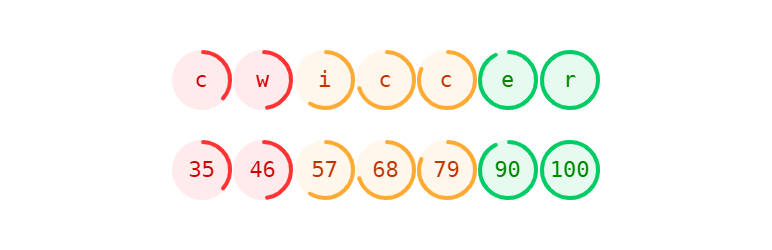

# cwiccer 

* Contributors: bobbingwide
* Donate link: https://www.oik-plugins.com/oik/oik-donate/
* Tags: shortcode, cwiccer
* Requires at least: 5.9
* Tested up to: 6.4-RC1
* Stable tag: 0.0.1
* Gutenberg compatible: Yes
* License: GPLv2 or later
* License URI: http://www.gnu.org/licenses/gpl-2.0.html

## Description 
Display PageSpeed Insights performance scores in a row.

Delivers the [cwiccer] shortcode to display PageSpeed Insights performance score(s).

## Installation 
1. Upload the contents of the cwiccer plugin to the `/wp-content/plugins/cwiccer' directory
1. Activate the cwiccer plugin through the 'Plugins' menu in WordPress
1. Use the shortcodes in your content and widgets

## Screenshots 
1. See the banner image

## Upgrade Notice 
# 0.0.1 
Upgrade for support for PHP 8.1 and PHP 8.2

# 0.0.0 
First version for cwiccer.com

## Changelog 
# 0.0.1 
* Changed: Support PHP 8.1 and PHP 8.2 #3
* Tested: With WordPress 6.4-RC1 and WordPress Multisite
* Tested: With PHP 8.0, PHP 8.1 and PHP 8.2
* Tested: With PHPUnit 9.6

# 0.0.0 
* Added: [cwiccer] shortcode #1
* Tested: With WordPress 5.9 and WordPress Multi Site
* Tested: With PHP 8.0
